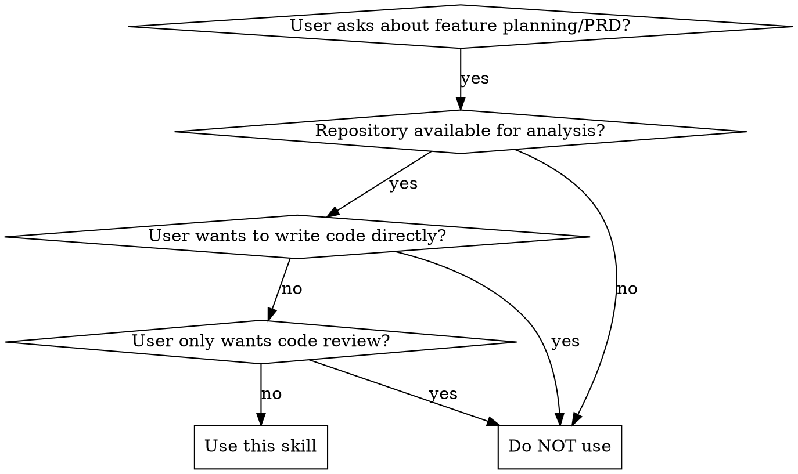

# PRD Generator

## Overview

**Analyze before you recommend.** Every feature proposal must be grounded in the repository's actual structure, existing features, and architecture patterns — never based on assumptions.



## When to Use

**Use this skill when:**
- User wants to analyze an existing repository for feature opportunities
- User requests a PRD for a new feature or improvement
- User asks "what's missing" or "what can be improved" in a codebase
- Planning feature development based on existing code

**Do NOT use when:**
- User wants to write code directly (not planning)
- User only wants a code review or bug report
- No repository is available for analysis
- User wants to edit or annotate existing documents

## Environment Check

1. **Agent tools required**: This skill uses `LS`, `Glob`, `Grep`, and `Read` to analyze repositories. No scripts are needed — all analysis is agent-driven.

2. **Optional Python library**: For YAML config parsing, `pip install PyYAML` may be needed.
   `python -c "import yaml; print('OK')"`

3. **Repository access**: The target repository must be accessible and readable. For private repos, ensure authentication is configured.

## Workflow

### Phase 1: Repository Discovery

Scan the repository to understand its foundation:

1. **Directory Structure**
   - List top-level directories and key subdirectories
   - Identify source code locations (`src/`, `lib/`, `app/`, etc.)
   - Locate configuration and build files

2. **Configuration Files** - Check for these key files:
   - `package.json` (Node.js/JavaScript)
   - `pyproject.toml`, `requirements.txt`, `setup.py` (Python)
   - `Cargo.toml` (Rust)
   - `go.mod` (Go)
   - `pom.xml`, `build.gradle` (Java)
   - `wrangler.toml` (Cloudflare Workers)
   - `vercel.json`, `netlify.toml` (Deployment platforms)

3. **Entry Points**
   - Find main files (`index.js`, `main.py`, `main.go`, `lib.rs`)
   - Identify server files (`server.js`, `app.py`)
   - Locate function handlers (serverless)

### Phase 2: Technology Stack Analysis

Read configuration files to extract:

| File | Extract |
|------|---------|
| `package.json` | dependencies, scripts, framework hints |
| `pyproject.toml` | dependencies, Python version, tools |
| `go.mod` | module name, dependencies |
| `Cargo.toml` | dependencies, Rust edition |
| `wrangler.toml` | Workers config, D1 bindings, KV namespaces |

Identify the architecture pattern:
- **Serverless**: Cloudflare Workers, AWS Lambda, Vercel Functions
- **Monolith**: Single entry point, all-in-one
- **Microservices**: Multiple services, API gateway
- **SPA**: Frontend framework, API calls
- **Full-stack**: Next.js, Nuxt, Remix

### Phase 3: Feature Extraction

Analyze source code to identify existing features:

1. **API Endpoints**
   - Search for route definitions
   - Map HTTP methods and paths
   - Document request/response patterns

2. **UI Components** (if applicable)
   - Locate component files
   - Identify pages/views
   - Map user flows

3. **Data Models**
   - Find schema files (`schema.sql`, `models/`, `prisma/schema.prisma`)
   - Document entities and relationships
   - Note validation rules

4. **Business Logic**
   - Identify service modules
   - Document core workflows
   - Note integration points

### Phase 4: Opportunity Identification

Based on analysis, identify gaps and opportunities:

**Common Missing Features by Project Type:**

| Type | Common Gaps |
|------|-------------|
| Web App | Auth, i18n, a11y, PWA, analytics |
| API | Rate limiting, API docs, versioning, caching |
| Serverless | Error tracking, logging, health checks |
| Mobile | Offline support, push notifications, deep linking |

**Improvement Categories:**
- Security (auth, validation, CORS, secrets)
- Performance (caching, optimization, lazy loading)
- UX (loading states, error handling, accessibility)
- DevOps (CI/CD, monitoring, logging)
- Quality (testing, linting, documentation)

### Phase 5: PRD Generation

Generate a structured PRD using the template in [references/prd-template.md](references/prd-template.md).

**Required Sections:**
1. Executive Summary
2. Problem Statement
3. Proposed Features (with user stories)
4. Technical Specifications
5. Implementation Roadmap
6. Success Metrics
7. Risk Assessment

**User Story Format:**
```
As a [user type], I want to [action] so that [benefit].

Acceptance Criteria:
- Given [context], when [action], then [outcome]
```

## Reference Files

- **[analysis-patterns.md](references/analysis-patterns.md)**: Detailed patterns for analyzing different project types
- **[feature-templates.md](references/feature-templates.md)**: Common feature templates by category
- **[prd-template.md](references/prd-template.md)**: Complete PRD document template

## Output Format

When generating output, offer these options:

1. **Full PRD** - Complete document with all sections
2. **Feature List** - Prioritized list of recommended features
3. **Skill Creation** - Generate a new skill in the repository's `skills/` folder

## Example

**Input:** A repository `express-api/` with `package.json` (Express, no auth), 8 route files, 1 SQLite schema.

**Phase 1-3 — Discovery & Analysis:**
- Tech stack: Express 4.x, SQLite, no auth middleware, no rate limiting, 0 tests
- Existing features: CRUD for 3 resources, basic error handling
- Gaps identified: Authentication, rate limiting, input validation, test coverage, API docs

**Phase 4-5 — PRD Output:**
```
prd-output/
└── express-api-security-prd.md     # 7 sections: Exec Summary, Problem Statement, 3 User Stories (JWT auth, rate limiting, input validation), Tech Specs, Roadmap (3 sprints), Success Metrics, Risk Assessment
```

## Quick Reference

| Task | Approach |
|------|----------|
| Discover structure | `LS`, `Glob` to map directory tree |
| Detect tech stack | Read `package.json`, `pyproject.toml`, `go.mod`, `Cargo.toml` |
| Find entry points | Search for `main.*`, `app.*`, `index.*`, `server.*` |
| Map API endpoints | Grep for route patterns (Express, FastAPI, Gin, etc.) |
| Identify data models | Locate `schema.sql`, `models/`, `prisma/schema.prisma` |
| Check for auth | Search for `jwt`, `passport`, `auth0`, `bcrypt` |
| Generate PRD | Use template in `references/prd-template.md` |
| Quick feature scan | `references/feature-templates.md` for common gaps |

## Common Mistakes

| Mistake | Fix |
|---------|-----|
| Skipping tech stack detection | Always read config files before proposing features — a Next.js app needs different features than a Go API |
| Proposing features without checking existing code | Grep for auth, caching, rate limiting first — they may already exist |
| Ignoring project type | A serverless function has different needs than a monolith; use `analysis-patterns.md` to classify |
| Suggesting features without prioritization | Use MoSCoW or impact/effort matrix to rank recommendations |
| Not tailoring to language ecosystem | Python recommendations differ from Rust/Go — use Language-Specific Patterns |
| Skipping the PRD template | Always use `references/prd-template.md` for consistent output structure |

## STOP Signs

These are **hard stops** — when you encounter them, you MUST take the specified action:

| STOP Sign | Required Action |
|-----------|-----------------|
| 🔴 No repository analysis done yet | MUST complete Phase 1-3 (discovery, tech stack, feature extraction) before generating PRD |
| 🔴 User hasn't confirmed scope/format | MUST ask: "要生成完整PRD、功能清单、还是新技能？" before generating output |
| 🔴 Proposed feature already exists in codebase | MUST verify by grepping the codebase. Do not recommend features that are already implemented. |
| 🔴 Feature recommendation contradicts project architecture | MUST explain the contradiction. E.g., recommending SSR for a static SPA requires justification. |
| 🔴 PRD template fields are empty or skipped | MUST fill all required sections (Executive Summary, Problem Statement, User Stories, Success Metrics, Risk Assessment) |
| 🔴 Empty or near-empty repository | MUST warn user that analysis will be limited and PRD will be high-level only |

### Why These Are Hard Stops

- **Analysis before recommendations**: Proposing features without understanding the codebase leads to irrelevant or duplicate suggestions. Phase 1-3 analysis is the evidence base for all Phase 4-5 output.
- **No duplicate feature proposals**: Recommending a feature that already exists wastes time and erodes trust. Always grep the codebase first.
- **PRD template completeness**: Skipping sections like Success Metrics or Risk Assessment turns a PRD into a wish list. Complete templates ensure actionable, measurable plans.

## Rationalization Counter-Table

When you catch yourself thinking these thoughts, read the reality:

| Excuse | Reality |
|--------|---------|
| "This is a common project type, I know what features it needs" | Every codebase is unique. Always run Phase 1-3 analysis before proposing features. |
| "The user didn't ask for user stories, I'll skip them" | User stories are the core of any useful PRD. Without them, features lack context. |
| "Success metrics are hard to define, I'll leave them blank" | A PRD without success metrics is a wish list. Define measurable outcomes. |
| "I'll just recommend all standard features" | Prioritization is required. Use MoSCoW or impact/effort matrix. |
| "This feature is popular in the ecosystem, must be relevant here" | Features must match the project's actual architecture, not ecosystem trends. |
| "The PRD template is long, I'll just summarize" | Template structure ensures completeness. Skipping sections means skipping analysis. |

## Red Flags — STOP and Review

- [ ] You're about to propose features without reading any source code
- [ ] You're generating a PRD without asking the user about output format preference
- [ ] You're skipping the user story section because "the user didn't ask for it"
- [ ] You're recommending features that conflict with the project's detected architecture
- [ ] You haven't checked for existing implementations of proposed features
- [ ] You're proposing features without prioritization (Must/Should/Could/Won't)

**Any checkbox checked means: stop, fix the issue, then continue.**

## Edge Cases

1. **Empty or near-empty repository**: Warn user. Generate high-level PRD based on project type classification only.
2. **Monorepo with multiple unrelated projects**: Ask user which specific project the PRD should target.
3. **Repository without standard package manager files**: Rely on file extensions and directory structure for tech stack detection.
4. **Private/internal repository with sensitive code**: Do not expose proprietary logic in PRD. Focus on feature descriptions, not implementation details.
5. **Legacy codebase (pre-2018, no modern tooling)**: Flag modernization as a prerequisite. Feature proposals may be constrained by old stack.
6. **User wants PRD for a feature that fundamentally changes architecture**: Call out the architectural impact explicitly in Risk Assessment.

## Language-Specific Patterns

For framework-specific analysis patterns, see **[references/analysis-patterns.md](references/analysis-patterns.md)**. Key language-agnostic indicators:
- Look for project configuration files to detect dependencies
- Check entry point patterns (`main.*`, `app.*`, `server.*`, `index.*`)
- Identify test infrastructure to understand quality practices
