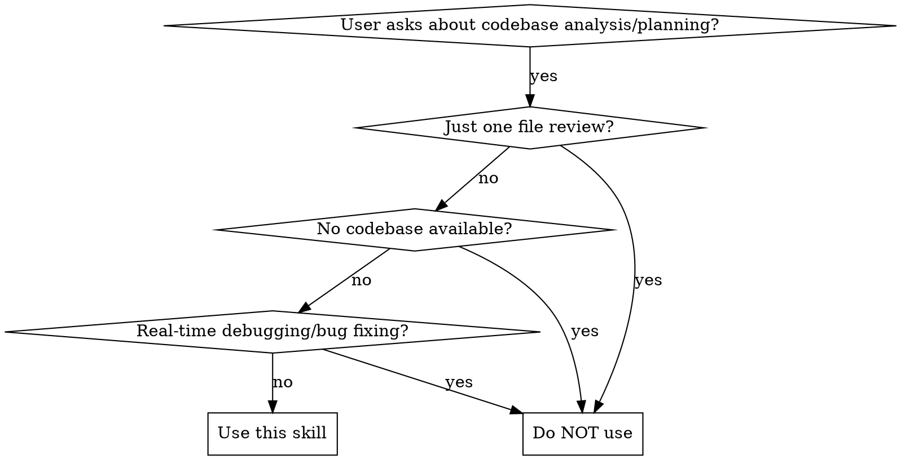

# Project Architecture Analyzer

Analyze project architecture and generate phased requirement planning with actionable goals.



## When to Use

**Use this skill when:**
- User requests architecture analysis of a codebase
- User wants a development roadmap or phased planning
- User asks about technical debt or improvement priorities
- User needs feasibility assessment or risk analysis
- Project has grown and needs architectural review

**Do NOT use when:**
- User wants a quick code review of a single file
- User is asking for real-time debugging or bug fixing
- No codebase is available for analysis
- User wants to write features (use prd-generator for planning first)

## Overview

This skill provides: tech stack detection, module dependency analysis, performance/security risk identification, phased planning (short/mid/long term), and feasibility assessment with measurable criteria.

## Environment Check (MANDATORY FIRST STEP)

1. **Python libraries**: Run `pip install PyYAML` if missing. Verify with:
   `python -c "import yaml; print('OK')"`

2. **Script availability**: Verify scripts are executable:
   ```bash
   python scripts/analyze_tech_stack.py --help
   python scripts/detect_dependencies.py --help
   python scripts/generate_report.py --help
   ```

3. **Project access**: Ensure the target repository path is accessible and readable. Use `LS` and `Read` tools to navigate.

## Workflow

### Phase 1: Architecture Analysis

#### 1.1 Project Scanning

Run the tech stack analyzer to detect project technologies:

```bash
python scripts/analyze_tech_stack.py <project_path>
```

This outputs:
- Project type classification
- Language distribution
- Framework detection (frontend/backend)
- Database identification
- DevOps tooling

#### 1.2 Dependency Analysis

Run the dependency detector to analyze module relationships:

```bash
python scripts/detect_dependencies.py <project_path>
```

This outputs:
- Module count and types
- Dependency graph
- Circular dependency detection
- Coupling metrics

#### 1.3 Manual Review

Complement automated analysis with:

- Directory structure review using `LS` tool
- Key configuration file inspection
- Entry point identification
- Critical path analysis

**Key files to check:**
- `package.json`, `requirements.txt`, `go.mod`, `pom.xml`
- Configuration files (`.env.example`, `config.*`)
- Entry points (`main.*`, `app.*`, `index.*`)

### Phase 2: Issue Identification

#### Priority Classification

| Priority | Name | Criteria |
|----------|------|----------|
| **P0** | Critical | Security vulnerabilities, data loss risk, blocking bugs |
| **P1** | High | Circular dependencies, architecture violations, performance issues |
| **P2** | Medium | Code smells, maintainability concerns, missing tests |
| **P3** | Low | Style issues, documentation gaps, minor optimizations |

#### Analysis Areas

1. **Architecture Issues**
   - Circular dependencies
   - Tight coupling (instability > 0.7)
   - Missing layer separation
   - God modules (> 500 LOC)

2. **Security Risks**
   - See `references/risk-assessment.md` for checklist
   - Check for exposed secrets
   - Validate authentication/authorization
   - Review dependency vulnerabilities

3. **Performance Bottlenecks**
   - N+1 query patterns
   - Missing caching
   - Large bundle sizes
   - Unoptimized assets

4. **Technical Debt**
   - Outdated dependencies
   - Missing tests
   - Code duplication
   - Missing documentation

### Phase 3: Requirement Planning

Use the templates in `assets/report-template/roadmap-template.md` for structured goal formatting. Apply SMART criteria from `[references/metrics-standards.md](references/metrics-standards.md)` and MoSCoW/OKR methods from `[references/planning-framework.md](references/planning-framework.md)` to define milestones and resource estimates.

**Short-term Goals (1-2 months):** Focus on quick wins — critical security fixes, circular dependency resolution, missing tests for critical paths, vulnerable dependency updates.

**Mid-term Goals (3-6 months):** Architecture improvements — refactor to reduce coupling, implement CI/CD pipeline, add comprehensive test coverage, performance optimization.

**Long-term Goals (6+ months):** Strategic initiatives — architecture migration (e.g., monolith to microservices), platform modernization, team capability building, technical debt elimination.

### Phase 4: Feasibility Assessment

#### Technical Feasibility

Evaluate each goal against:
- Current team skills
- Technology compatibility
- Integration complexity
- Migration risks

#### Resource Assessment

| Resource | Available | Required | Gap |
|----------|-----------|----------|-----|
| Developers | X | Y | Z |
| Time | X weeks | Y weeks | Z |
| Budget | $X | $Y | $Z |

#### Risk Matrix

See `references/risk-assessment.md` for detailed framework.

```
              IMPACT
         Low    Med    High
    ┌────────┬────────┬────────┐
High│ Medium │ High   │ Critical│
    ├────────┼────────┼────────┤
Med │ Low    │ Medium │ High   │
    ├────────┼────────┼────────┤
Low │ Low    │ Low    │ Medium │
    └────────┴────────┴────────┘
         PROBABILITY
```

### Phase 5: Report Generation

Generate the final report:

```bash
python scripts/generate_report.py tech_stack.json dependencies.json [project_name]
```

Or use the template in `assets/report-template/architecture-report.md`.

## Output Format

Use the report templates in `assets/report-template/`:
- **[architecture-report.md](assets/report-template/architecture-report.md)** — Architecture analysis report structure
- **[roadmap-template.md](assets/report-template/roadmap-template.md)** — Phased requirement planning structure

Key sections to include: Executive Summary, Tech Stack Analysis, Module Architecture, Issues (P0-P3), Recommendations, Feasibility Assessment.

## Example

**Input:** A Node.js Express project at `./my-api/`

**Phase 1 — Automated analysis:**
```bash
python scripts/analyze_tech_stack.py ./my-api/
# → tech_stack.json: Express 4.x, PostgreSQL, no auth, no caching
python scripts/detect_dependencies.py ./my-api/
# → dependencies.json: 12 modules, 1 circular dependency detected
```

**Phase 2-3 — Manual review + planning:** P0: Add authentication middleware. P1: Resolve circular dependency in `utils/` ↔ `services/`. P2: Add test coverage for critical paths.

**Phase 5 — Output:**
```
reports/
└── my-api-architecture-report.md    # Full report with P0-P3 issues, SMART goals, feasibility matrix
```

## Reference Files

| File | Purpose |
|------|---------|
| `references/architecture-patterns.md` | Common patterns and anti-patterns |
| `references/tech-stack-templates.md` | Tech stack detection heuristics |
| `references/planning-framework.md` | SMART goals, OKR, MoSCoW methods |
| `references/metrics-standards.md` | Quality metrics and acceptance criteria |
| `references/risk-assessment.md` | Risk identification and mitigation |

## Scripts

| Script | Purpose |
|--------|---------|
| `scripts/analyze_tech_stack.py` | Detect project technologies |
| `scripts/detect_dependencies.py` | Analyze module dependencies |
| `scripts/generate_report.py` | Generate structured reports |

## Quick Reference

| Task | Approach |
|------|----------|
| Detect tech stack | `python scripts/analyze_tech_stack.py <path>` |
| Analyze dependencies | `python scripts/detect_dependencies.py <path>` |
| Generate report | `python scripts/generate_report.py tech_stack.json dependencies.json [name]` |
| Review directory structure | Use `LS` tool on key directories |
| Check config files | Read `package.json`, `go.mod`, `pyproject.toml`, etc. |
| Classify issue severity | Use P0-P3 priority table (see Phase 2) |
| Generate roadmap | Template in `assets/report-template/roadmap-template.md` |
| Assess risk | Framework in `references/risk-assessment.md` |

## Common Mistakes

| Mistake | Fix |
|---------|-----|
| Skipping automated scripts and going straight to manual review | Run `analyze_tech_stack.py` + `detect_dependencies.py` first for objective data |
| Treating all issues as equal priority | Classify with P0-P3 severity; focus on P0/P1 first |
| Forgetting to validate script output | Automated tools may miss edge cases — always manually verify entry points and critical paths |
| Making vague recommendations | Use SMART criteria: Specific, Measurable, Achievable, Relevant, Time-bound |
| Ignoring team constraints | Recommendations must account for team size, timeline, and budget |
| Proposing large rewrites instead of incremental steps | Break changes into smaller, safe iterations |

## STOP Signs

These are **hard stops** — when you encounter them, you MUST take the specified action:

| STOP Sign | Required Action |
|-----------|-----------------|
| 🔴 No `config_template.yaml` exists | MUST generate or ask user for config before starting analysis |
| 🔴 User says "just take a quick look" | MUST remind user that proper analysis requires running scripts first |
| 🔴 Script execution fails (missing deps, wrong path) | MUST fix environment issues. Do not skip to manual review. |
| 🔴 Security-sensitive files detected (`.env`, secrets) | MUST NOT expose. Note existence but do not read contents into report. |
| 🔴 Project has 0 dependencies or is empty | MUST warn user and ask if analysis should proceed on limited data |
| 🔴 Script output contradicts manual findings | MUST flag discrepancy. Do not silently trust one over the other. |

### Why These Are Hard Stops

- **Scripts required before manual review**: Automated analysis provides objective data (module counts, dependency graphs, coupling metrics) that human review alone cannot produce. Skipping scripts means relying on biased, incomplete impressions.
- **Security-sensitive file protection**: Exposing `.env` files or secrets in reports creates real security incidents. These files must be noted by name only, never read for content.
- **Script/manual discrepancy**: When automated tools and human review disagree, both could be wrong. Flagging the discrepancy forces investigation rather than silent assumption.

## Rationalization Counter-Table

When you catch yourself thinking these thoughts, read the reality:

| Excuse | Reality |
|--------|---------|
| "This project is small, I can skip the scripts" | Scripts provide objective data even for small projects. Manual review introduces bias. |
| "The dependency graph looks fine, no need to run detect_dependencies.py" | Circular dependencies are not visible to human eye — only automated detection catches them. |
| "I'll just look at package.json and guess the architecture" | Configuration files only tell part of the story. Directory structure and entry points matter too. |
| "P2/P3 issues aren't important, I'll skip them" | Today's P3 is tomorrow's P0. Document all issues for the record. |
| "The user didn't specify team size/budget, so I'll skip feasibility" | Ask the user for constraints. Vague plans without resource matching are useless. |
| "A full rewrite would solve all these problems" | Large rewrites rarely succeed. Recommend incremental improvements unless the codebase is truly unsalvageable. |

## Red Flags — STOP and Review

- [ ] You're about to skip running analyze_tech_stack.py or detect_dependencies.py
- [ ] You're making recommendations without P0-P3 priority classification
- [ ] You're about to propose a large rewrite as the primary recommendation
- [ ] You're ignoring team size, timeline, or budget in feasibility assessment
- [ ] You haven't validated script output against manual directory review
- [ ] You're generating a report without asking user about their priorities

**Any checkbox checked means: stop, fix the issue, then continue.**

## Edge Cases

1. **Monorepo with multiple projects**: Ask user which sub-project(s) to analyze. Run scripts per sub-project.
2. **Project with no package manager files** (raw scripts): Tech stack detection relies on file extensions and directory patterns only.
3. **Very large codebase (>10k files)**: Run scripts with `scope_dirs` in config to limit analysis scope.
4. **Script execution blocked** (no Python, permission issues): Fall back to manual analysis using config file inspection and directory traversal.
5. **Mixed language project**: Document each language separately. Note integration points between language ecosystems.
6. **Legacy project (no VCS, no docs)**: Flag as high-risk. Recommend documentation and VCS setup as P0 goals.


